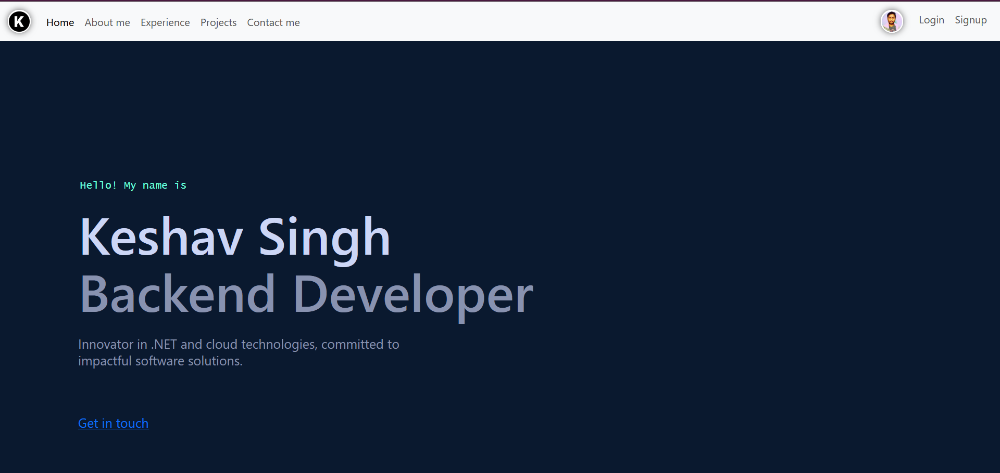

# Omkr Web App Portfolio

An Angular 16 portfolio & showcase application featuring accessible UI components, theming (light/dark/high-contrast), internationalization scaffolding, sitemap generation, analytics integration hooks, and modular architecture for future expansion (blog, admin, visitor analytics, messaging, Spotify/GitHub integrations, Azure AD B2C auth skeleton).

---



## Table of Contents

1. Overview
2. Key Features
3. Tech Stack
4. Architecture & Project Structure
5. Getting Started
6. Available NPM Scripts
7. Configuration & Environment
8. Theming & Accessibility
9. Internationalization (i18n)
10. SEO, Sitemap & Robots
11. Analytics & Telemetry
12. Development Guidelines (Scaffolding Reference)
13. Future Roadmap
14. Contributing
15. License

---

## 1. Overview

This repository contains a personal / professional portfolio web application built with Angular 16 and Material Design principles. It emphasizes progressive enhancement, accessibility (WCAG-aligned improvements), content structure, and readiness for future service integrations (authentication, analytics, file handling, visitor tracking, messaging, Spotify, GitHub data, etc.).

## 2. Key Features

- Angular 16 + Standalone-friendly module structure (classic NgModules retained for organization)
- Responsive layout with Bootstrap 5 & custom SCSS theme variables
- Light / Dark theme toggle with persistent preference
- High Contrast mode for accessibility (stored in `localStorage`)
- Accessible command palette (dialog + combobox ARIA pattern)
- Enhanced navigation semantics (`aria-current`, skip link, structured landmarks)
- Contact form with validation, live status + assertive error summary region
- SEO assets: `sitemap.xml`, `robots.txt`, dynamic sitemap generator script
- i18n foundation (`assets/i18n/en.json`, `@ngx-translate/*`)
- Modular service layers (files, messages, page views, visitors, analytics placeholders)
- Environment-based API endpoint mapping (dev vs prod)
- Image & static asset organization
- Future-ready integration endpoints (GitHub, Spotify, Azure AD B2C, AWS-like user APIs)

## 3. Tech Stack

| Layer | Technology |
|-------|------------|
| Framework | Angular 16.x |
| UI Toolkit | Angular Material, Bootstrap 5, Font Awesome |
| Styling | SCSS (`theme.scss`) + CSS custom properties |
| Routing | Angular Router |
| i18n | `@ngx-translate/core` |
| Auth (planned) | Azure AD B2C (`@azure/msal-angular`) skeleton config |
| Analytics (optional) | `ngx-google-analytics` (present) + custom services |
| Build | Angular CLI |
| Deployment (example) | Static hosting (Firebase config present) |
| Tooling | ESLint, Karma/Jasmine tests |

## 4. Architecture & Project Structure

High-level directories:

```text
src/
   app/
      components/        # Feature + UI components (home, general, etc.)
      models/            # Data models & interfaces
      services/          # Layered service APIs (analytics, files, messages, etc.)
      pipes/             # Custom pipes (e.g., SafeUrl)
      animations/        # Reusable animation definitions
   assets/
      i18n/              # Translation JSON files
      images/            # Static images / previews
      files/             # PWA manifest and related
   environments/        # environment.ts & environment.prod.ts
tools/
   generate-sitemap.mjs # Route-based sitemap generator
```

Key design notes:

- Services isolate endpoint templates (`{orgId}`, `{userName}`, `{pageId}`) for dynamic substitution.
- Accessibility-first component updates (header, command palette, contact form) focus on keyboard navigation & screen reader clarity.
- Theming handled via CSS variables toggled at the `body` level.

## 5. Getting Started

Prerequisites:

- Node 18+ (recommended) & npm
- Angular CLI (`npm install -g @angular/cli`)

Install dependencies:

```bash
npm install
```

Run dev server:

```bash
npm start
# Visit http://localhost:4200/
```

Generate sitemap before a production build (automatically chained in build script):

```bash
npm run build
```

Serve production build (example using `http-server`):

```bash
npm i -g http-server
http-server dist/omkr.web-app.portfolio
```

## 6. Available NPM Scripts

| Script | Purpose |
|--------|---------|
| `start` | Run dev server (Angular live reload) |
| `build` | Generate sitemap then build production bundle |
| `sitemap` | Manually regenerate `src/sitemap.xml` |
| `test` | Run unit tests (Karma/Jasmine) |
| `lint` | Run ESLint over application source |
| `watch` | Build in watch mode (development) |

## 7. Configuration & Environment

Environment files: `src/environments/environment.ts` & `.prod.ts`.

Notable dev settings (non-sensitive examples shown):

```ts
awsUserApiBaseUrl: 'https://dev-api-v2.keshavsingh.net'
contactApiBaseUrl: 'https://dev-api-v2.keshavsingh.net'
blogUrl / adminUrl
github: { clientId, redirectUri, username }
AzureAdB2C: { tenantName, clientId, policies, logoutRedirectUri }
scopes: { weather: [...], user: [...] }
```

Sensitive values (API keys like `x-api-key`) should be externalized for production via build-time injection or server-driven proxies. Do NOT commit real secrets to version control.

### Endpoint Token Replacement

Placeholder segments like `{orgId}`, `{userName}`, `{pageId}`, `{key}` are replaced at runtime by services before HTTP calls.

## 8. Theming & Accessibility

Implemented accessibility features:

- Skip link for keyboard users
- Single `<main>` landmark enforcement
- Hidden structural `<h1>` for consistent document outline
- High contrast mode (`body.high-contrast` class; persisted)
- Theme toggle with `aria-pressed` state
- Command palette: dialog + combobox semantics (`role="dialog"`, `aria-activedescendant`, listbox/options)
- Live regions: polite status + assertive error summary for forms
- Improved focus styling and respect for `prefers-reduced-motion`
- Back-to-top button hidden from AT when not visible

High Contrast Mode: stored in `localStorage` key `highContrast` (`'1' | '0'`).

See `docs/development-guidelines.md` for detailed theming + accessibility conventions (focus states, variable usage, high contrast policy, and checklist for new components).
 
### Printable Resume (/resume)

The application now includes a dedicated `/resume` route providing a print‑optimized résumé view:

- Minimal layout (no navigation, theme toggles, or interactive UI in print)
- Semantic sections: Summary, Experience, Skills, Education, Links
- Screen-only Print button triggers `window.print()`
- Global `@media print` stylesheet hides non-essential elements and adds link URL suffixes

To customize:

- Edit `resume.component.html` content blocks
- Adjust print tweaks in `resume.component.css` and global `styles.css` `@media print` rules
- Replace placeholder email / experience entries with real data


Future a11y enhancements (roadmap candidates):

- Automated axe-core audits in CI
- Focus trap utility for dialogs/modals
- Language switcher controlling `<html lang>`
- More robust error message association using `aria-describedby`

## 9. Internationalization (i18n)

Currently English only (`assets/i18n/en.json`). To add another language:

1. Create `assets/i18n/<lang>.json`.
2. Provide a language switch service & persist choice.
3. Update `TranslateModule` configuration and dynamically set `<html lang>` attribute.

## 10. SEO, Sitemap & Robots

- `tools/generate-sitemap.mjs` parses `app-routing.module.ts` and emits `src/sitemap.xml`.
- Output includes priority heuristic & last modified date.
- `robots.txt` and duplicate `sitemap.xml` also mirrored under `src/assets/` for hosting flexibility.
- Add meta tags / structured data via a future SEO service (`SeoService` already present for titles/descriptions).

## 11. Analytics & Telemetry

`Analytics`, `PageView`, and `Visitor` services provide an abstraction layer for tracking. Integrations can push events to:

- Google Analytics (via `ngx-google-analytics`)
- Custom backend endpoints (defined in environment endpoint maps)

Add error monitoring (Sentry/App Insights) by wrapping a provider at `AppModule` level.

## 12. Development Guidelines (Scaffolding Reference)

Common Angular generation commands:

```bash
ng g component path/to/feature/your-component
ng g service path/to/feature/your-service
ng g guard auth/auth-guard
ng g interface models/thing --type=model
ng g enum models/status
ng g module feature/feature-name --routing
ng g directive shared/directives/your-directive
ng g pipe shared/pipes/your-pipe
```

Run linter:

```bash
ng lint
```

Add 3rd party feature schematics:

```bash
ng add <package-name>
```

## 13. Future Roadmap

- Re-introduce automated accessibility tests (axe-core) via Playwright or Jest + jsdom
- Add lazy loading boundaries for feature areas (home subsections / admin)
- Implement PWA enhancements (service worker, offline caching, manifest pruning)
- Dark mode contrast tuning & custom theme editor
- Performance budgets & bundle analysis (e.g. `source-map-explorer`)
- Image optimization pipeline (WebP/AVIF + responsive sources)
- Integrate GitHub API (recent repos/activity) & Spotify now-playing widget
- Enhanced security: strict CSP headers, SRI hashes for external CDNs
- CI pipeline (GitHub Actions) for lint + test + build + deploy
- Error monitoring integration (Sentry / Azure App Insights)
- Internationalization expansion (hi, es, fr, etc.)

## 14. Contributing

Contributions, issues, and suggestions are welcome.

1. Fork the repository
2. Create a feature branch: `git checkout -b feat/awesome-thing`
3. Commit changes: `git commit -m "feat: add awesome thing"`
4. Push branch: `git push origin feat/awesome-thing`
5. Open a Pull Request describing motivation & changes

Coding style:
 
- Follow Angular & ESLint rules (`npm run lint`)
- Prefer accessible HTML first; only add ARIA when needed
- Keep service method names verb-based and model interfaces noun-based

Extended practices (architecture, a11y checklist, print rules, theming tokens) are documented in `docs/development-guidelines.md`.

## 15. License

If no LICENSE file is present this project currently defaults to “All rights reserved” by the author. To make it open source under MIT, add a `LICENSE` file (see suggestion section in repository issues or ask the maintainer).

---

### Accessibility (Detailed Summary Reference)

For quick auditing, notable implemented patterns:

- `.visually-hidden` utility for screen-reader-only text
- Skip link jumps to main content region
- Single `<main>` landmark maintained
- Header nav uses semantic anchors w/ `aria-current`
- Hidden `<h1>` preserves logical heading outline
- Command palette: dialog, focus restore, active descendant for list keyboard navigation
- Contact form: autocomplete hints, assertive error summary, polite status region
- High contrast & theme toggles with persisted state
- Back-to-top hidden from AT when off-screen


### Security Note

Do not expose real API keys or secrets in committed `environment.ts` files for production. Use environment variable replacement or remote configuration.

### Support

For questions open an issue or reach out via the contact form implemented in the app.

Enjoy building & iterating! 🔧
